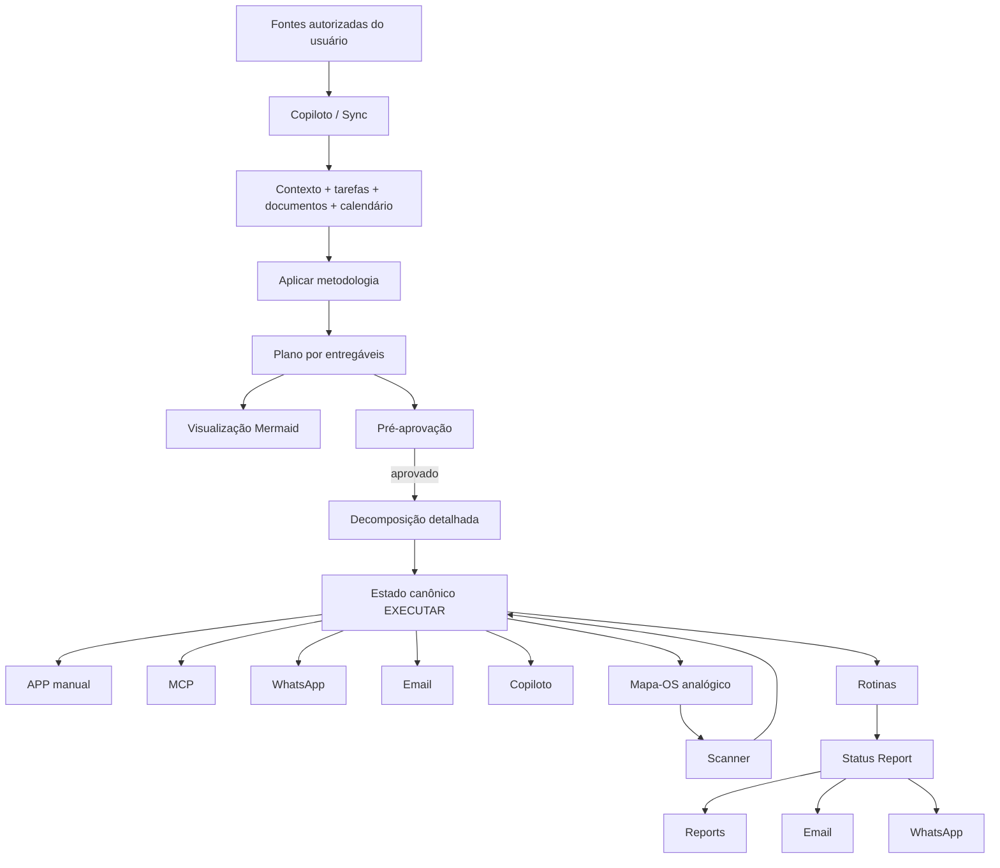

# EXECUTAR — Fluxo de Uso Omnicanal

## 1. Princípio

O EXECUTAR deve permitir que o usuário planeje uma vez e continue administrando e executando o trabalho por diferentes superfícies sem depender de abrir continuamente o aplicativo.

A fonte de verdade continua digital e canônica. App, MCP, Email, WhatsApp, Copiloto e Mapa-OS + Scanner são superfícies de leitura/ação sobre o mesmo estado.

## 2. Fluxo principal

1. **Sincronizar contexto**
   - O Copiloto consulta dados autorizados do usuário.
   - Quando disponível, usa capabilities de produtividade para sincronizar tarefas, contexto, comunicação, calendário, documentos e sistemas externos.
   - Dados não disponíveis permanecem `NAO_DETERMINADO`.

2. **Executar automação de gestão**
   - O Copiloto usa o Modo Rotinas para sincronizar estado, elegibilidade, capacidade, bloqueios e progresso.
   - O Status Report canônico é persistido no app.
   - Email e WhatsApp são canais de entrega derivados quando configurados.

3. **Gerar / estruturar plano**
   - O agente aplica metodologia compatível com o objeto e o contexto.
   - Antes de decompor em detalhe, organiza a proposta por **entregáveis**.
   - Produz visualização Mermaid e três famílias de entregáveis:
     1. Onboarding de uso, comandos do Copiloto e Scanner.
     2. Status Report.
     3. Mapa-OS.

4. **Gate de pré-aprovação**
   - Todo plano ou replanejamento relevante deve apresentar primeiro:
     - objetivo;
     - entregáveis;
     - dependências macro;
     - capacidade/restrições conhecidas;
     - riscos/bloqueios;
     - visualização;
     - próximos estados.
   - A decomposição detalhada ocorre somente depois da pré-aprovação do desenho orientado a entregáveis.

5. **Operar**
   - Após aprovação, o agente pode decompor `Projeto/Processo → Entregável → Fluxo/Tarefa → Ação → Evidência`.
   - O usuário pode operar por qualquer canal autorizado.

6. **Reconciliar**
   - Toda ação recebida por qualquer canal volta ao mesmo estado canônico.
   - O sistema recalcula elegibilidade, WIP, progresso e próxima ação.

7. **Emitir**
   - Atualiza Overview/Agora/Hoje/Amanhã/Reports.
   - Quando aplicável, emite novo Status Report e/ou novo Mapa-OS.

## 3. Diagrama

## 4. Entregáveis padrão do agente

### DELIV-ONB-001 · Onboarding
Deve ensinar:
- conceito do EXECUTAR;
- fluxo de uso;
- comandos do Copiloto;
- como interpretar Agora/Hoje/Amanhã;
- como imprimir e usar Mapa-OS;
- como usar Scanner;
- como configurar símbolos e ações;
- como alterar canal de gestão.

### DELIV-ROUT-001 · Status Report
Já possui contrato e template próprios.

### DELIV-MAPA-* · Mapa-OS
É o entregável analógico/imprimível para gestão das tarefas e posição operacional.

## 5. Workspace

Rotas conceituais:

`Projeto(s) → Documentos → Calendário → Overview → Roadmap → Sprint → Agora → Hoje → Amanhã → Ontem → Copiloto → Mapa-OS → Scanner → Reports → Automações → Workflows`

Regras:
- `Documentos` contém arquivos anexados a entregáveis/objetos do projeto; não é um segundo sistema de projeto.
- `Projeto` pode ser individual.
- `Projetos` pode oferecer visão agregada/remix multi-projeto.
- `Agora`, `Hoje`, `Amanhã` e `Ontem` são projeções temporais/operacionais, não estruturas paralelas.

## 6. Modos de visualização de tarefas

- **WIP 1:1** — modo de foco; uma unidade operacional ativa dominante.
- **Lista** — inventário ordenado.
- **Kanban** — visão por estado/fluxo.

Escopo:
- projeto individual;
- remix multi-projeto.

A visualização não pode alterar a semântica do estado.

## 7. Canais de gestão

O usuário deve poder administrar o mesmo trabalho por:
1. App manualmente.
2. MCP.
3. WhatsApp.
4. Email.
5. Agente Copiloto.
6. Mapa-OS + Scanner.

Prioridade de experiência: **Mapa-OS + Scanner** para continuidade analógica sem reabrir o app.

## 8. Separação de objetos

A UI deve distinguir claramente:
- tarefa isolada;
- processo recorrente;
- projeto;
- entregável;
- ação.

Uma tarefa isolada pode existir sem projeto/processo quando permitido pelo domínio. Processo e projeto possuem estrutura, dependências e visualizações próprias.

## 9. Scanner configurável

O Scanner deve suportar configuração de:
- símbolo visual;
- `VisualSymbolId`;
- comando;
- ação de domínio;
- escopo;
- política de confirmação;
- feedback;
- Undo, quando aplicável.

O reconhecimento visual não executa diretamente a mutação: `recognition → VisualSymbolId → CommandDispatcher → domain action`.

## 10. Estado documental

Este fluxo consolida a intenção de produto e está em `draft_for_pre_approval`. Ele não declara conectores, MCP, WhatsApp, Email, Scanner ou automações como implementados/testados/verificados.
