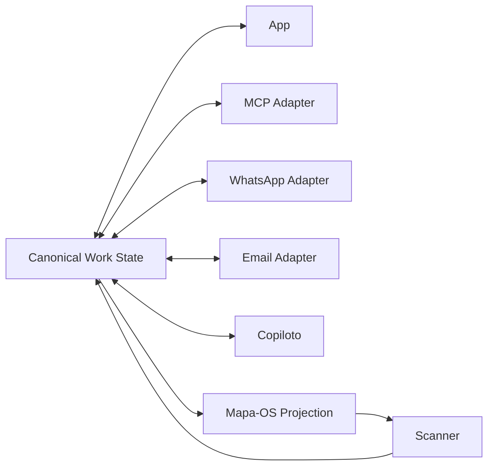

# ADR-OMNI-001 — Estado canônico único com adaptadores omnicanal

## Contexto

O EXECUTAR precisa permitir gestão por App, MCP, WhatsApp, Email, Copiloto e Mapa-OS + Scanner, sem exigir uso contínuo da interface principal.

## Decisão proposta

Adotar **um único estado canônico de trabalho**. Cada canal atua como adapter/surface e deve operar através dos mesmos contratos de domínio e authority gates.

## Regras

1. Canal não mantém fonte de verdade paralela.
2. Toda mutação deve resolver para comando de domínio.
3. Projeções (`Mapa-OS`, `Hoje`, `Amanhã`, `Kanban`) não duplicam objetos.
4. Falha de canal é problema de delivery/integration, não de estado do trabalho.
5. Scanner reconhece símbolo; `CommandDispatcher` resolve a ação.
6. MCP expõe capabilities; não substitui domínio nem authority policy.
7. Pre-approval é gate anterior à decomposição detalhada para novos planos/replanejamentos relevantes.

## Consequências

Positivas:
- continuidade entre canais;
- menor dependência da UI;
- auditabilidade;
- possibilidade de execução analógica;
- integração com outras AIs via MCP.

Custos:
- necessidade de idempotência;
- command routing uniforme;
- reconciliação;
- autenticação/identidade por canal;
- conflitos e ordering;
- observabilidade de adapters.

## Status de implementação

Não determinado por este ADR. O MCP anexado permanece em fase de revisão documental e possui gates próprios antes de implementação.
